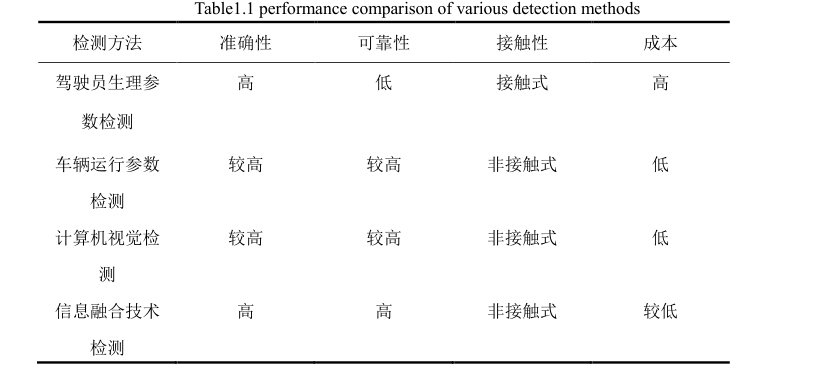

# 人脸疲劳检测相关资料



```txt
CMU（卡内基梅隆大学）经过论证和反复的试验，提出了度量疲劳的物理量—单位时
间内眼睛闭合时间所占的比例 PERCLOS（Percentage of Eyelid Closure over the
Pupil over Time），并提出单位时间内眼睛闭合时间占比在 80%以上即 PERCLOS
的 P80 标准可以很好的评价驾驶员的疲劳程度。

AdaBoost 算法的人脸检测及人眼检测


由于目前还没有公开的人眼数据库，这里在BioID．DatabaSe人脸数据库
(http：∥mVw．bioid．com／dowIlloads／fkedb／index．php，含1521个384×286灰度自然场景下的人脸图像)中截取
一部分人眼作为正样本，另外一部分作为实验测试集。
负样本的选择采用两种方法，一是采用不包含人眼和人脸的自然背景，因为在人
眼检测中出现误检的部分经常出现在人脸上，二是在BioID人脸库中去除双眼部
分剩下的人脸部分作为负样本，把非眼睛部分的人脸区域包括进去进行训练，来
降低误检率。

由于汽车在行驶的过程中，驾驶室的光照变化很快，这将会导致不同时刻提
取到的驾驶员的灰度图像整体亮度有一定的差异，所以在样本的训练和待检测的
视频序列之前，需要对图像进行光照强度校正预处理。
直方图均衡化是图像处理中常用的图像增强技术，通常用来增加图像的全局
对比度，通过这种方法，亮度可以更好地在直方图上分布，这样就可以用于增强
局部的对比度而不影响整体的对比度。经过直方图均衡化后，灰度图像整体灰度
跨越区域更大，灰度值分布更加均匀，对比度增强，人脸轮廓和人眼轮廓更加明
显，而且整体亮度值基本上也是一致的，保证后期样本训练过程的可信度。此外，
在预处理过程还包括样本大小的归一化过程，本文选择人脸样本归一化尺寸为
20x20，人眼尺寸为24×18。
 ```

 ```txt
 人脸数据库汇总
http://blog.csdn.net/zhouyelihua/article/details/55684816
 ```
